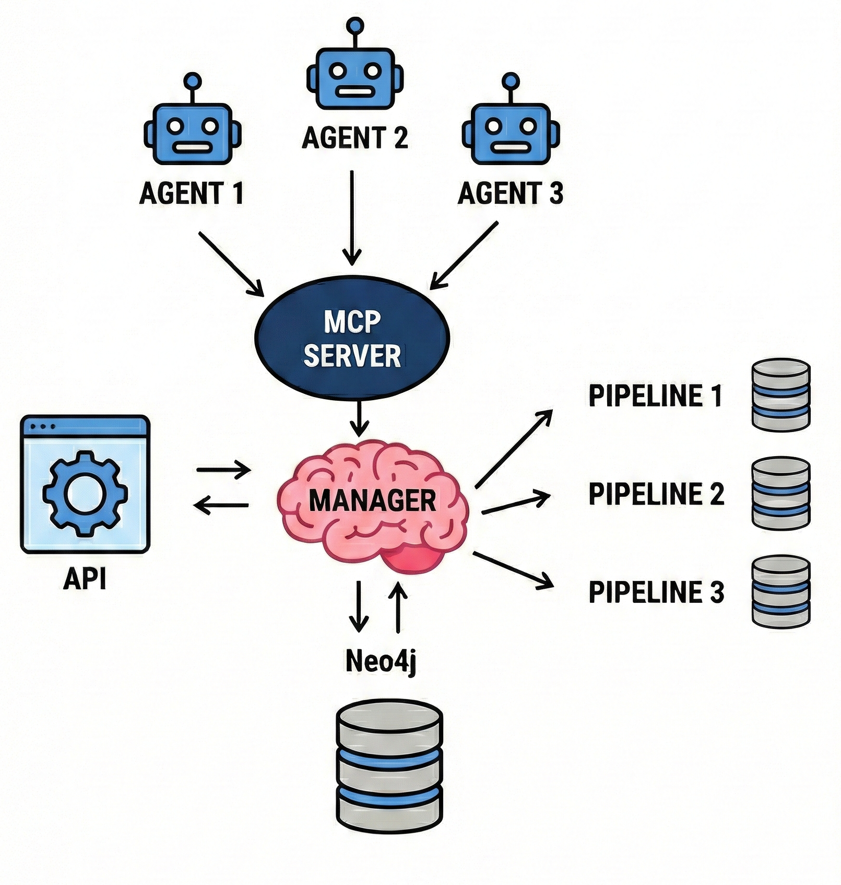
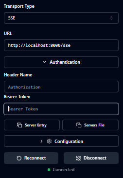

# 🧠 RAG-Document

Advanced system for centralized and optimized management of RAG (Retrieval-Augmented Generation) Pipelines with modular architecture capable of providing ultra-low latency responses to LLM agent requests.

## 📋 Table of Contents

- [Architecture](#️-architecture)
- [Features](#-key-features)
- [Project Structure](#-project-structure)
- [Installation](#-installation)
- [Usage](#-usage)
- [Testing and Benchmarks](#-testing-and-benchmarks)
- [Technologies](#-technologies)

---

## 🏗️ Architecture

<p align="center">
  
</p>

The system is orchestrated by modular components that manage the end-to-end document flow:

### Core Components

| Component | Description |
|------------|-------------|
| **🤖 MCP Server** | Authenticates and routes multi-agent requests with token-based verification |
| **🧠 Core Manager** | Central orchestrator that manages pipelines, evaluates queries, and performs the retrieval process |
| **🌐 API Server** | Exposes REST endpoints (FastAPI) for vector store creation and deletion operations |
| **🗄️ Neo4j Database** | Tracks created vector stores and their configurations |

---

## ✨ Key Features

- ⚡ **Parallel processing** of multiple requests from distributed agents
- 🧩 **Intelligent cache** that loads only the most frequently used vector stores into memory
- 🔄 **Modular system** with 10+ interchangeable RAG strategies:

### Supported Retrieval Strategies

- **Sparse Retrieval** – BM25 for lexical search
- **Semantic Search** – Embedding-based similarity
- **Hybrid Retriever** – Combination of sparse + semantic
- **Contextual Header** – Adds document metadata context to chunks
- **Hierarchical Indices** – Multi-level indices for complex documents
- **Multi-Query RAG** – Generates multiple queries for greater coverage
- **Parent Document** – Chunk retrieval with parent context
- **Query Transformations** – Automatic query reformulation
- **Relevant Segment Extraction** – Extraction of nearby relevant segments
- **Reranking** – Result reordering with cross-encoder models

---

## 📁 Project Structure

```text
rag_document/
├── api/                    # REST API endpoints (FastAPI)
├── config/                 # System configuration and logging
├── db/                     # Database connectors (Neo4j, Vector DB)
├── docs/                   # Document ingestion directory (PDF, DOCX, TXT)
├── llm/                    # LLM provider integrations (Groq, OpenAI)
├── mcp_server/             # Model Context Protocol server
├── src/                    # Core logic
│   ├── retrievers/         # RAG strategy implementations
│   ├── cache.py            # Vector store caching
│   ├── chunker.py          # Document chunking strategies
│   ├── embedder.py         # Embedding generation
│   ├── pipeline.py         # Pipeline orchestration
│   └── manager.py          # Core manager
└── test/                   # Testing and benchmarking
    ├── results/            # Benchmark output (Excel)
    ├── faqs.json           # Test question dataset
    ├── run_judge.py        # LLM-as-a-Judge evaluation
    ├── test_pipeline.py    # Pipeline creation benchmark
    └── test_retriever.py   # Retriever latency benchmark
```

---

## 🚀 Installation

### Prerequisites

- Python 3.9+
- Docker & Docker Compose (optional but recommended)
- Neo4j Database (local or cloud)
- API key for LLM provider (Groq/OpenAI)

### Option 1: Docker (Recommended)

Fastest method for complete testable environment:

```bash
# Clone the repository
git clone https://github.com/abernardini-unimi/nlp-project.git
cd rag-document

# Start containers
docker-compose up -d --build
```

**System automatically initializes:**
- Neo4j database → `http://localhost:7474` (user: `neo4j`, password: `00000000`)
- 5 vector stores with random documents from `docs/`
- API server → `http://localhost:8000`
- MCP server → `http://localhost:3000`

**Change retriever:** Edit `RETRIEVER_TYPE` in `docker-compose.yml` (default: `HybridRetriever`)

Recommended: `Bm25Retriever`, `ParentDocumentRetriever`, `HybridRetriever`

### Option 2: Local Installation

For development or custom deployment:

```bash
# 1. Setup virtual environment
cd rag-document
python -m venv venv
source venv/bin/activate  # Linux/Mac
# venv\Scripts\activate   # Windows

# 2. Install dependencies
pip install torch --index-url https://download.pytorch.org/whl/cpu
pip install -r requirements.txt

# 3. Download language models
python -m spacy download it_core_news_sm
python -c "import nltk; nltk.download('punkt_tab'); nltk.download('punkt'); nltk.download('stopwords')"

# 4. Configure environment variables
cp .env.example .env
# Edit .env with your credentials
```

**Required .env configuration:**
```bash
NEO4J_URI=bolt://localhost:7687
NEO4J_USER=neo4j
NEO4J_PASSWORD=your_password
GROQ_API_KEY=your_groq_key
# Other parameters...
```

---

## 💻 Usage

### System Startup

```bash
python main.py --retriever 'Name of the retriever to use'
```

Retrievers with best trade-off between speed and accuracy:
- Bm25Retriever
- ParentDocumentRetriever 
- HybridRetriever 

The system automatically initializes:
- 5 vector stores with documents from `docs/`
- API server on `http://localhost:8000`
- MCP server for agent connections

### Testing with MCP Inspector

Open a new terminal and start the inspector:

```bash
npx @modelcontextprotocol/inspector
```

**Server connection:**

1. Enter the MCP server URL
2. Provide the vectorstore authentication token

<p align="center">
  
</p>

3. Go to the tool section and select the 'search_documents' tool
4. Search your query

### Service Management via API

#### Service Creation/Update

Create a new RAG service with custom documents:
```bash
curl -X POST http://localhost:3000/api/mcp/save_service \
  -H "Content-Type: application/json" \
  -d '{
    "name": "Legal Documents Service",
    "description": "RAG service for legal contract analysis",
    "tokens": ["legal_token_abc123", "legal_token_xyz789"],
    "customer_name": "ACME Corp",
    "documents": [
      {
        "name": "contratti_fornitori.pdf",
        "chunk_size": 1024,
        "chunk_overlap": 100,
        "min_chunk_size": 256
      },
      {
        "name": "policy_privacy.docx",
        "chunk_size": 512,
        "chunk_overlap": 50,
        "min_chunk_size": 128
      }
    ]
  }'
```

N.B. Documents must be present in the docs/ folder

**Success response:**
```json
{
  "result": true,
  "message": "Service saved successfully"
}
```

#### Service Deletion

Remove an existing service:
```bash
curl -X POST http://localhost:3000/api/mcp/delete_service \
  -H "Content-Type: application/json" \
  -d '{
    "service_name": "Legal Documents Service",
    "customer_name": "ACME Corp"
  }'
```

**Success response:**
```json
{
  "result": true,
  "message": "Service deleted successfully"
}
```

## 🧪 Testing and Benchmarks

All results are saved in `test/results/` as Excel files with detailed metrics.

### 1. Pipeline Creation Benchmark

Measures initialization time for each retriever:

```bash
python -m test.test_pipeline
```

**Output:** `pipeline_full_benchmark.xlsx`

### 2. Retrieval Latency Test

Runs FAQ dataset on all retrievers, reporting latency times for each retriever (minimum, average, and maximum) plus detailed results of the requests made:

```bash
python -m test.test_retriever
```

**Output:** `retriever_performance_benchmark.xlsx`

### 3. Quality Evaluation (LLM-as-Judge)

An LLM model evaluates whether the retrieved chunks can answer the posed question:

```bash
python -m test.run_judge
```

**Output:** `retriever_performance_benchmark_judged.xlsx`

---

## 📝 Disclaimer

This project was developed by **Alessio Bernardini** with the assistance of AI tools to accelerate the development process:

- **Claude (Anthropic)** was used as a coding assistant to speed up implementation, refactoring, and documentation
- **Gemini (Google)** was utilized for web research and to identify the most suitable retrieval strategies

The architectural decisions, system design, and overall project direction remain the work of the author. AI tools were employed as productivity enhancers, not as primary developers.

---
